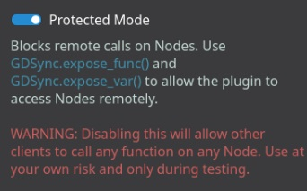

# hpc-sorting-serious-game

HPC serious game showcasing how collaborative effort between processes and threads can speedup sorting. The game should support Android as a platform first.
12
## Reqiuirements

- No login required
- webserver with localhost
- target webpage and phone
- cards single rectangle with number inside

### Functionalities

- Select how many cards you want to sort from menu
- Click two cards and swap them (Possibly to put card in a buffer)
- Should mimic smart algorythm
- Big button for start the time and stop the time when he click stop the time (Timer is the most important part)
- Start the server (maybe start the exe next to godot app and act as a host)

## Roadmap

- [x] Implement a screen with cards that players choses the range of values amount of cards (e.g. 15-1000 with 64 cards to sort)
- [x] Implement a screen with cards that players can sort

---

- [x] Implement a screen with cards that players can sort in parallel
- [x] Implement a screen with cards that players can sort in parallel with threads
- [x] Implement a screen with cards that players can sort in parallel with processes
- [x] Implement a screen with cards that players can sort in parallel with processes and threads
- [x] Implement a screen with cards that players can sort in parallel with processes and threads and shared memory
- [x] Implement a screen with cards that players can sort in parallel with processes and threads and shared memory and message passing

## Using Godot 4 with C# support

With c# it is necessary to export binaries for other platforms to work e.g. android.

## FAQ

Export to windows need to use [rcedit](https://github.com/electron/rcedit/releases) and [for icon](https://docs.godotengine.org/en/stable/tutorials/export/changing_application_icon_for_windows.html)
[Export from godot](https://docs.godotengine.org/en/stable/tutorials/export/exporting_for_android.html)

### No communication between nodes

The problem lies with the default setting for GDSync. By default, it block communication between nodes. To enable communication, disable "proteected mode" in Project -> Tools -> GDSync. This will allow nodes to communicate with each other.
