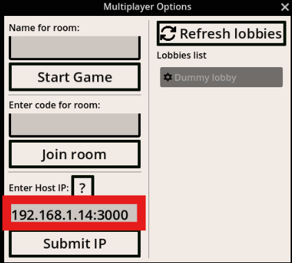

# hpc-sorting-serious-game

HPC serious game showcasing how collaborative effort between processes and threads can speedup sorting.

## Test at

<https://siponek.github.io/hpc-sorting-serious-game/>


## Installation

### Play though browser

- [Just open the link above in your](<https://siponek.github.io/hpc-sorting-serious-game/>) chrome browser and start playing. Without any installation needed, this can serve as a __client__ for multiplayer mode as well.

> [!WARNING]
> Without a signaling server (setup using __just__, instructions below) connecting to multiplayer mode will not be possible, but you can still play singleplayer mode.
>
> GitHub Pages (`https`) + local LAN signaling (`http://192.168.x.x:3000`) is blocked by browser security in most cases.
> For LAN multiplayer, use the local HTTPS hosting flow below.

### Windows prerequisites

You need to have the following software installed to run the game on windows

- Google Chrome [LINK To chrome download page](https://www.google.com/intl/en_en/chrome/)
- Chocolatey [LINK To chocolatey download page](https://chocolatey.org/install)
  - To install chocolatey run this command inside powershell with admin privileges

    ```powershell
    Set-ExecutionPolicy Bypass -Scope Process -Force; [System.Net.ServicePointManager]::SecurityProtocol = [System.Net.ServicePointManager]::SecurityProtocol -bor 3072; iex ((New-Object System.Net.WebClient).DownloadString('https://community.chocolatey.org/install.ps1'))
    ```

> [!IMPORTANT]
> Every chocolatey install command must be run in powershell with admin privileges since it needs to write to system folders. You can open powershell with admin privileges by searching for "powershell" in start menu, right clicking on it and selecting "Run as administrator"

- Python >= 3.12 (for webserver and signaling server)
  - Install python using chocolatey

    ```powershell
    choco install python312
    ```

  Then you can close the terminal and open it again to have chocolatey in your path

  - Install uv for your global python (for project management, an alternative to pipenv or poetry)
  
    ```powershell
    pip install uv
    ```

  - Install just (for project automation, an alternative to __make__)

    ```powershell
    choco install just
    ```

### Run locally

- Clone the repository

  ```pwsh
  git clone https://github.com/Siponek/hpc-sorting-serious-game.git
  ```

- Move to the project directory

  ```pwsh
  cd hpc-sorting-serious-game
  ```

- Install the dependencies using just and uv

  ```pwsh
  just sync
  ```

- Start game locally
  - For __singleplayer__ just start the webserver

    ```pwsh
    just test-web-local
      ```

    OR just drag exports\web-export\index.html to your chrome browser

## LAN Multiplayer Quick Start (same Wi-Fi)

This is the recommended flow when one host PC runs the game + signaling server, and other devices (PC/phone) only use a browser.

### Host setup (Windows)

Run once (creates local HTTPS certs in `exports/certs`):

```pwsh
just setup-lan-https
```

Get your LAN IP (copied to clipboard):

```pwsh
just get-ip
```

If you also want host:port copied (for signaling):

```pwsh
just get-ip-with-port
```

Then start both servers in separate terminals:

```pwsh
just signaling-server
```

```pwsh
just test-web-local
```

### Client setup (other PCs/phones)

1. Connect to the same Wi-Fi network as host.
2. Open game page from host:
   - `https://<HOST_IP>:8000`
   - Example: `https://192.168.1.14:8000`
3. In Multiplayer Options 
    - As a __host__ enter the name for room and click __Start Game__
    - As a __client__:
        - submit signaling server IP:
      - `<HOST_IP>:3000`
            

      - Click __Submit IP__

          - Enter the name for room OR select one of the lobbies from Lobbies List after clicking __Refresh Lobbies__ and click __Join Game__

4. Host creates a lobby, clients refresh/join.

### Notes

- Do not use `http://<HOST_IP>:8000` when running `just test-web-local`; it serves __HTTPS__.
- If `just test-web-local` says port `8000` is already in use, stop the process it prints and run again.
- Signaling server root endpoint is informational:
  - `http://<HOST_IP>:3000/`
  - Health/info endpoint:
  - `http://<HOST_IP>:3000/api/server/info`

### Troubleshooting

- Ensure inbound firewall rules allow TCP `8000` (web) and `3000` (signaling) on host.
- Ensure clients are not on guest Wi-Fi / AP isolation.
- If phone cannot open `https://<HOST_IP>:8000`, verify host can open it first:

```pwsh
curl -vk https://<HOST_IP>:8000/
```

- If using GitHub Pages as client, local signaling over LAN is not a supported deployment model.
  Use either:
  - full LAN local hosting (this section), or
  - public HTTPS signaling server.

> [!IMPORTANT]
> Make sure to run the game on separate tabs in chrome, since tabs might freeze in the background for other players

## FAQ

### My browser blocks the connection to the host with a security warning

This is because the game is served over HTTPS, but the host uses a self-signed certificate that the browser does not trust. You can bypass this warning by clicking on "Advanced" and then "Proceed to <HOST_IP> (unsafe)". This will allow you to connect to the host and play the game.

### I want to run the game on a different port

You can change the ports used by the webserver and signaling server by modifying the `just` commands in the `justfile`. For example, to change the webserver port to `8080`, you can modify the `just test-web-local` command to:

```pwshjust test-web-local:
    uv run python -m http.server 8080 --directory exports/web-export
```

### Other players cannot connect to my host

Try the following steps to troubleshoot the issue:

1. Ensure that you have started both the webserver and signaling server on the host.
2. Ensure that the host and clients are on the same Wi-Fi network.
3. Ensure that the host's firewall allows inbound connections on the webserver and signaling server ports (default `8000` and `3000`).
4. Ensure that you are using the correct IP address of the host when connecting from clients.
5. Check with netstat or similar tool that the host is actually listening on the expected ports.

    ```pwsh
    netstat -an | findstr :8000
    ```

    An example of output:

    ```pwsh
    netstat -ano | findstr :8000
    ```

    ```pwsh
      TCP    0.0.0.0:8000           0.0.0.0:0              LISTENING       10940
      TCP    192.168.1.14:8000      192.168.1.12:41444     ESTABLISHED     10940
      TCP    192.168.1.14:8000      192.168.1.14:50060     CLOSE_WAIT      10940
      TCP    192.168.1.14:8000      192.168.1.14:52771     CLOSE_WAIT      10940
      TCP    192.168.1.14:8000      192.168.1.14:54526     CLOSE_WAIT      10940
      TCP    192.168.1.14:8000      192.168.1.14:55908     CLOSE_WAIT      10940
      TCP    192.168.1.14:8000      192.168.1.14:64571     CLOSE_WAIT      10940
      TCP    192.168.1.14:50060     192.168.1.14:8000      FIN_WAIT_2      19820
      TCP    192.168.1.14:52771     192.168.1.14:8000      FIN_WAIT_2      19820
      TCP    192.168.1.14:54526     192.168.1.14:8000      FIN_WAIT_2      19820
      TCP    192.168.1.14:55908     192.168.1.14:8000      FIN_WAIT_2      19820
      TCP    192.168.1.14:64571     192.168.1.14:8000      FIN_WAIT_2      19820
    ```

    ```pwsh
    Stop-Process -Id 10940 -Force
    ```

### Export to windows need to use [rcedit](https://github.com/electron/rcedit/releases) and [for icon](https://docs.godotengine.org/en/stable/tutorials/export/changing_application_icon_for_windows.html)

### [Export from godot](https://docs.godotengine.org/en/stable/tutorials/export/exporting_for_android.html)
